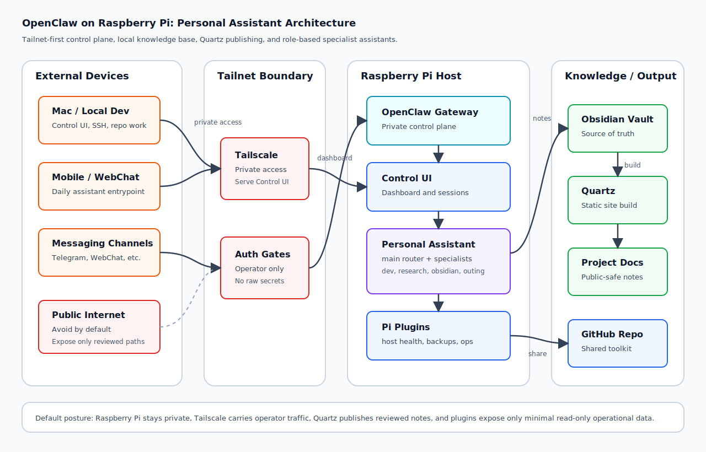

# OpenClaw Raspberry Pi

Raspberry Pi에서 OpenClaw를 오래 켜두고 운영하기 위한 플러그인, 런북, 대시보드, 시스템 설정 모음입니다.

## Goal

- Raspberry Pi를 개인 OpenClaw gateway host로 안정적으로 운영한다.
- Control UI에서 Pi 상태를 볼 수 있는 read-only host health 기능을 만든다.
- 설치, 업데이트, 백업, 모니터링, Tailnet 노출, Quartz/Vault 운영 패턴을 문서화한다.
- 다른 사람도 따라 할 수 있게 안전한 기본값과 예시를 제공한다.

## Initial Scope

- `docs/architecture.md`: Raspberry Pi, Tailscale, OpenClaw, Vault, Quartz, personal assistant roles를 묶은 architecture overview
- `docs/control-ui-host-health-panel.md`: Control UI 안에 Raspberry Pi health panel을 붙이는 현재 방식
- `plugins/host-health`: CPU, memory, disk, temperature, uptime을 읽는 OpenClaw 플러그인 후보
- `runbooks/`: Raspberry Pi 운영 절차
- `docs/`: 설계 문서와 공유용 설명
- `scripts/`: Pi 상태 수집, 검증, 설치 보조 스크립트
- `examples/`: systemd, Tailscale, reverse proxy 등 예시 설정

## Architecture

See [Architecture](docs/architecture.md) for the full system overview.

## Safety Principles

- 기본은 read-only.
- tokens, private IPs, host keys, account IDs, message contents는 repo에 넣지 않는다.
- Control UI나 dashboard는 loopback 또는 tailnet-only를 기본값으로 한다.
- 공개 가능한 문서와 개인 환경 값은 분리한다.

## Roadmap

- [ ] Host health metric collector 작성
- [ ] OpenClaw plugin descriptor prototype 작성
- [x] Control UI 표시 방식 검증
- [x] Raspberry Pi architecture overview 작성
- [ ] systemd service 예시 추가
- [ ] Tailscale Serve 예시 추가
- [ ] Backup and restore runbook 작성
- [ ] Quartz/Vault 운영 runbook 작성

## Repo Status

Created locally on 2026-06-10.
